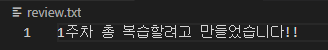

# Git 관련 용어들 복습

 - git init : git 환경 생성
 - git add . : git의 가상환경에 파일들을 저장
 - git commit : git 가상환경에 저장된 파일들을 git에 저장
 - git branch <이름> : branch를 <이름> 으로 생성
 - git branch : branch들의 이름 확인
 - git branch -d <이름> : <이름>의 branch 삭제
 - git checkout <이름> : <이름>의 branch로 환경 변경
 - git merge <master이름> <branch이름> : branch와 master 를 병합 (여기서 오류가 날 경우 git에서는 어느부분이 오류가 났는지 확인 시켜주며 그 부분을 찾아서 해결한 후 merge를 진행하면됨.)
 - git remote : local 이름 확인
 - git remote add <이름> <원격 저장소 주소> : 원격저장장치를 <이름> 의 로컬에 생성해줌
 - git restore <파일이름> : add된 파일을 취소할 수 있음. (ex => 1이라는 파일을 잘못올렸을경우 git restore 1 을 해줄경우 add된 상태에서 제거함)
 - git pull <로컬이름> <master이름> : GitHub 사이트에서 수정을 했을 경우 반드시 pull을 이용하여 변경된 점을 가져온 후 master에서 수정해야지 push에서 오류가 발생하지않음.
 - git push <로컬이름> <master이름> : 로컬에서 작업한 내용들을 GitHub 사이트로 넣어주는 명령어 여기서도 마찬가지로 사이트에서 수정을 한 경우 push를 넣을때 오류가 발생하기 때문에 pull에서 말한 내용을 주의할 것.
 - git clone <로컬이름> <복사해올 주소> : 복사해올 주소의 환경전체를 <로컬이름>에 넣어준다. (.git 파일이 없어도 그 환경전체를 복사해오기때문에 처음 작업을 할 경우 이 명령어를 이용하여 전체 환경을 복사해오면 편함)
 - .gitignore : git add를 해줄때 해줄 필요가 없는 파일들을 작성해서 만들어 둘 경우 그 파일들은 add 되지않음.

 ## 👉**실습 과제**
  - 새로 저장소를 생성하여 브랜치를 이용하여 파일을 추가 병합해보기 (도중에 오류 해결도)

  1. git init을 사용하여 새로운 저장소를 만든다.

  

  2. status, log 등을 활용하여 상태를 점검 후 touch를 이용해 파일 생성

  

  3. 만들어진 review 파일을 수정한 후 commit한 뒤 상태 확인.

  

  

  4. branch가 따로 있는지 확인 후 없으면 생성하여 브랜치로 이동한다.

  

  5. 이동한 branch에서 파일을 생성 후 수정한 다음 commit 한다.

  

  

  6. master로 넘어와 log 내용을 확인해본다

  

  7. branch에서 log 한 기록이 master에 없는데 이를 추가해주기 위해 merge를 사용하여 master에 branch에서 다룬 내용을 합쳐준다.

  

  8. log를 통하여 master와 합쳐진 것을 확인하였으므로 branch를 삭제해준다.

  

  9. 실습하고 정리한 내용들을 GitHub에 올리기 위해 GitHub에 새로운 페이지를 만든다.

  

  10. 생성한 페이지의 주소를 내 local 에 저장해준다.

  

  

  11. commit 했던 기록들을 GitHub에 올리고 잘 올라갔는지 확인한다.

  

  

**- 이번주 배웠던 내용들 중 생각나는 내용들을 복합적으로 다루기 위해 머리속에서 생각나는 순서대로 정리해봤음.**
**- 오류 관련해서는 따로 모아서 정리를 해볼 예정**
**- Shared Repository 와 Fork & Pull Request의 차이 : 수정권한이 있는가 없는가의 차이.**