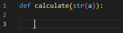
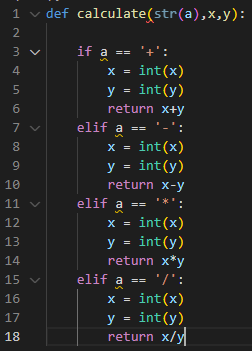
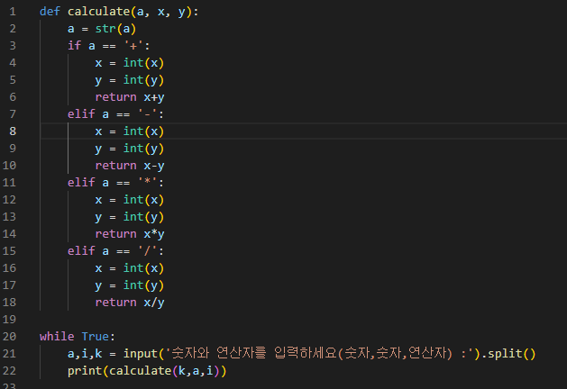
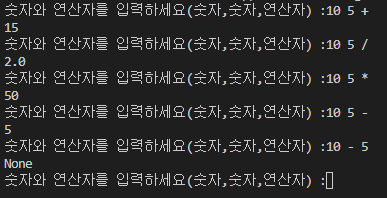
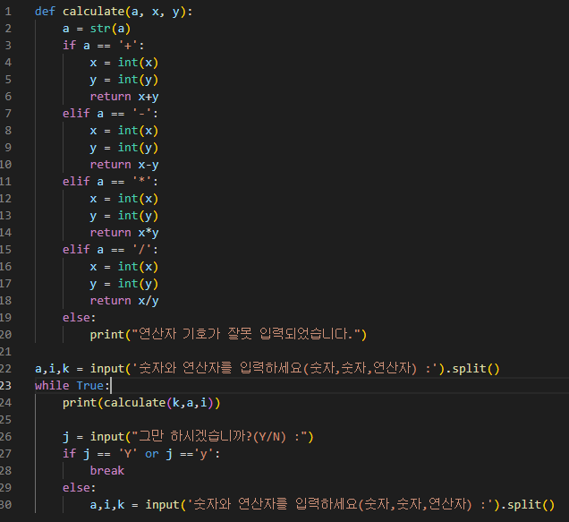
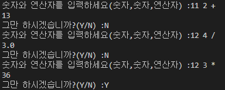

# Python
  - 타 언어에 비해 접근성이 매우 쉽다.
  - 다양한 플랫폼에서 지원이 된다.
  - 프로그래밍에 관련된 지식이 없어도 쉽게 배울 수 있다.

  

  - 타 언어들처럼 int, str, float 를 정해 줄 필요없이 값을 넣으면 스스로 인식한다.
  - 예외적으로 내가 type을 정해 줄 경우 그 type으로 변한다.

  

  - 간단하게 형을 변환 시킬 수 있다는 장점이 있다.
  - 다양한 연산자들과 문법들이 존재하며 일차별 정리해 둔 내용을 다시보면 문법을 간단하게 알 수 있다.

# 내가 해볼 실습
  **- 연산자와 함수를 사용하여 간단한 계산기 만들기**

  1. def 를 사용하여 함수를 생성한다.

  

  2. 내가 주어진 입력값을 어떻게 주는지에 따라 함수를 제어할 지를 결정한다.

  
  
    - 2개의 변수와 연산자 기호를 활용하여 구성하였다.
    - 조건문에서 '+', '-', '*', '/' 와 들어온 str(a)값이 같을때 각 연산자를 시행하도록 만들었다.

  3. 위에서 구성한 함수에 넣을 main 문을 작성한다.

  

    - 숫자, 숫자, 연산자 식으로 input 값을 받아왔다.
    - while True 라는 무한루프를 이용하여 계산기가 계속 작동하도록 만들었다.

  

    - 값들도 잘 나오는 것을 확인할 수 있다.
    - None이 나온경우 제대로 값이 출력되지 않았다.
    - 조건문을 좀 자세히 설정할 경우 제대로 된 계산기를 만들어 낼 수 있다.

  4. 실제 조건문을 추가하여 좀 더 복잡한 계산기를 만들어 볼 수 있다.

  

    - 연산자가 잘못 입력되었을때 메세지를 출력하게 하였고
    - 세세한 조건문을 추가하여 계속 반복되는 계산기를 멈출 수 있도록 만들었다.

  

    - 동작이 잘 되는걸 확인할 수 있다.

# 한 주 후기

  - 이번주는 간단한 문법을 시작하였고 모든 시작의 기초를 배운 주였기 때문에 다양한 문제를 접하여 반복 숙달해야 한다는 생각이 들었다.
  - 실제 간단한 이론문제들을 풀어서 확인해 보았고 다음주에는 이런 문법을 바탕으로 조금 심화과정에 들어갈 것 같다.
  - 아직까지는 숙달하고 복습하는데에 문제는 없으며 진도를 따라갈 수는 있다.
  - 좀 더 복잡해지기 시작하면 다른 주위사람들과 스터디를 만들어 복습을 해보고 싶다.